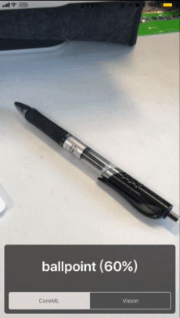

# Demo for CoreML and Vision framework

## Usage

- Download ResNet50 model file from https://developer.apple.com/machine-learning/
- Clone this project
- Place the `Resnet50.mlmodel` file at root of CoreMLDemo folder
- Build and Run

